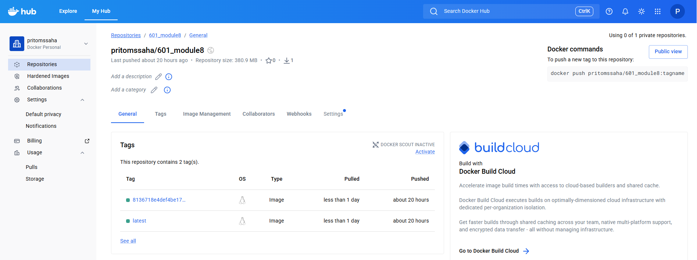
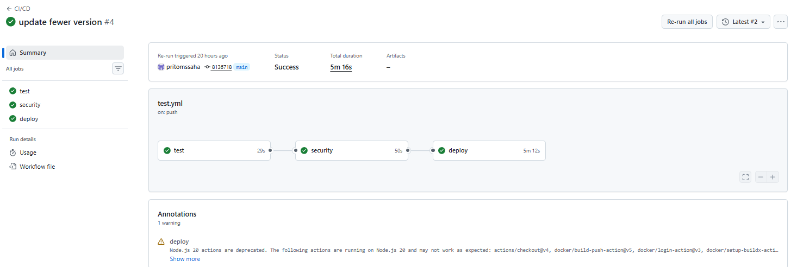

# Docker Hub
```bash
https://hub.docker.com/repository/docker/pritomssaha/601_module8/general
```


# Github Workflow


## Steps to run the application
### pull the image from docker hub
```bash
docker pull pritomssaha/601_module8:latest
```
### Run the container
```bash
docker run -d --name module8_container -p 8000:8000 pritomssaha/601_module8
```
### Verify the container is running
```bash
docker ps
```
### After the test is complete, stop the container
```bash
docker stop module8_container
```
